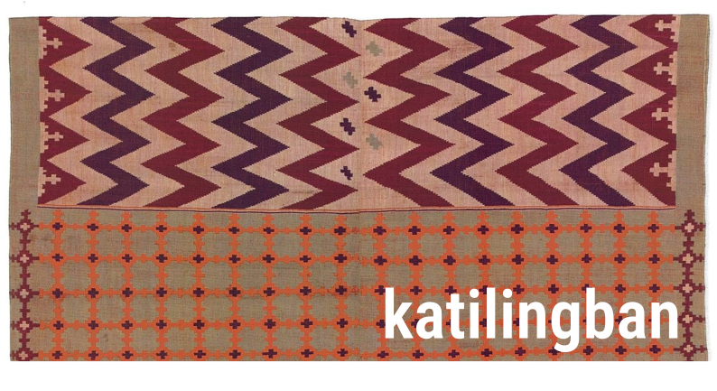

{fig-align="center"}

::: {.callout-note collapse="true"}

## Zoom calling in details

**Join Zoom Meeting:**    
[https://us06web.zoom.us/j/83300874682?pwd=6Tgs3en7veQn1JgE5dsy24Y5k5UKlb.1&jst=2](https://us06web.zoom.us/j/83300874682?pwd=6Tgs3en7veQn1JgE5dsy24Y5k5UKlb.1&jst=2)

**ID:** 83300874682    
**Passcode:** 532051

:::

We will be having our first ever Community Call on **Wednesday, 18th of March 2026**.

Our theme for our first Community Call is around the term ***katilingban*** (*[ka-ti-ling-ban]*), a word for *community*, *society*, or *group* from the Cebuano or Bisaya language spoken in parts of the Visayas and Mindanao regions of the Philippines.

We have named this session *"Tawag sa Katilingban / A Call to Community"* which we believe is apt for our first ever Community Call and for this early stage of growing the nutriverse community. We call on those who self-identify with the nutriverse mission and values to come and join us on this day!

::: {.img-float}

{style="float: right; margin: 10px; width: 300px"}

:::

We are joined on this day by [Dr Noam Ross](https://www.noamross.net/), Executive Director of [rOpenSci](https://ropensci.org/), an organisation that fosters a culture of open and reproducible research using shared data and reusable software. rOpenSci builds social and technical infrastructure for the [R](https://r-project.org) language to enable researchers and engineers to collaborate, share, and publish their science, data, and methods. Noam will be chatting with us on all things open science and reproducible research based on his many years of experience as a community member and now a community leader not just of rOpenSci but of the wider open science movement.

