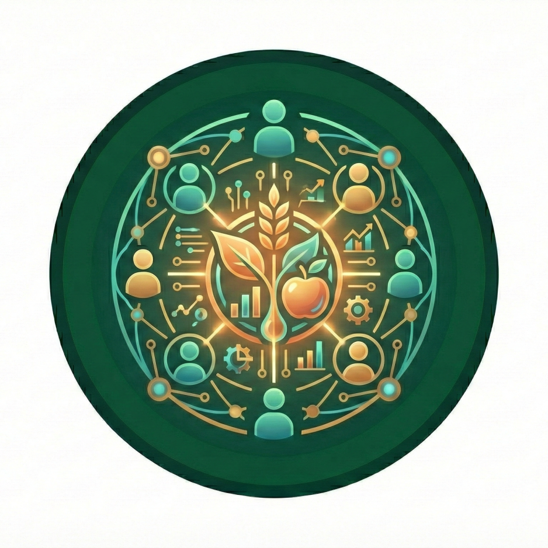

nutriverse develops open source technical tools and systems along with a community of practice infrastructure that actively participates in, leverages, and stewards the use of these tools and systems for the purpose of open and reproducible nutrition data analytics and research. Our core team and community cultivate an inclusive and welcoming space where people with diverse backgrounds and experience levels can learn, exchange ideas, and collaborate openly through shared norms and open-source software. All participation in nutriverse activities is guided by our [Code of Conduct](https://nutriverse.io/code-of-conduct.html).

We encourage contributions from people of all backgrounds and skill levels, whether in coding, documentation, mentoring, localisation, or other forms of participation. Your perspective matters, whether you’re an experienced programmer or just getting started. You don’t have to identify as a developer to make a meaningful impact. You might **spend 30 minutes** sharing how you use a package in our [Zulip chat forum](https://nutriverse.zulipchat.com){.external target="_blank"} or reporting a bug, **an hour** attending a Community Call to learn something new, or **take on a longer-term role** helping to maintain a package.

## What are some benefits of contributing?

* Build connections with a community committed to advancing open science in the nutrition field
* Learn from people in other fields who use R and face challenges similar to your own
* Explore and address new research questions by discovering new tools and collaborators
* Develop confidence in writing code and creating software within a supportive environment
* Increase the visibility of your open source contributions
* Enhance the software you use or develop
* Strengthen your [R](https://r-project.org) and other technical skills while helping others grow theirs
* Sharpen your writing abilities
* Grow your mentoring experience
* Raise the profile of your research

## Our community

::: {.img-float}

{style="float: left; margin: 10px; width: 250px"}

:::

Our community is our greatest asset, and we believe our diversity is our strength. Our community is both tangible and intangible, everywhere and nowhere at once. It’s made up of people who believe in our collective mission, share our values, and are committed to learning, improving, and innovating together. It’s people who care about building open, reusable, and reproducible research software, while also fostering inclusive spaces grounded in empathy and trust. At [nutriverse](https://nutriverse.io), there are no silly questions; we value the many paths, perspectives, and levels of experience that bring people to coding in [R](https://r-project.org).

The [nutriverse](https://nutriverse.io) community is a self-identifying network of [R](https://r-project.org) users and developers who collectively support the technical and social infrastructure for open and reproducible research. We focus especially on software and best practices that reduce barriers to working with health and nutrition data. Community members include those who use, cite, and share use cases for [nutriverse](https://nutriverse.io) packages; attend or speak at Community Calls; contribute blog posts; participate in events or domain-focused groups; answer questions in our [Zulip chat forum](https://nutriverse.zulipchat.com){.external target="_blank"} and our other discussions fora; engage in project discussions by reporting issues and suggesting or implementing improvements; contribute to or maintain packages; serve as mentors, or trainers; or help localise materials.

Diversity is central to our values. We welcome anyone committed to making their approach to health and nutrition data more open and to supporting others in doing the same, regardless of technical background, career stage, or professional sector. We embrace people of all backgrounds, including but not limited to all sexual orientations, gender identities, and races. We are anti-racist and recognise that inclusion does not happen automatically, especially as communities grow, that it requires intention and care. Through various initiatives and localisation efforts, we strive to ensure that our research software serves and reflects the full breadth of our community. Our work is supported by [nutriverse](https://nutriverse.io)’s Community Director and guided by a [Code of Conduct](https://nutriverse.io/code-of-conduct/) with clear behavioural expectations and reporting processes, upheld by a committee that includes core team and independent community member/s.

## Discover

Improving the discoverability of health and nutrition data, tools, and best practices is central to our aims. For many people, using our package/s is their first introduction to [nutriverse](https://nutriverse.io). It often serves as a starting point for deeper engagement whether by connecting with other users or sharing their own use cases.

Browse the *"I want to"* statements below to find opportunities that spark your interest. Click on any action listed under a statement to learn more about the related [nutriverse](https://nutriverse.io) resource and how you can get involved.

### I want to ...

#### Discover packages I can use to facilitate my research and access open health and nutrition data

* [Browse nutriverse packages](https://nutriverse.io/packages)

* [Read blog posts or tech notes](https://nutriverse.io/blog.html#category=packages) about specific [nutriverse](https://nutriverse.io) packages, about creative use cases for multiple [nutriverse](https://nutriverse.io) packages, or about open data accessible through our packages

* Subscribe to our newsletter by email or via [RSS](https://nutriverse.io/blog.xml)

* Follow [nutriverse](https://nutriverse.io) on [Mastodon](https://mastodon.social/@nutriverse){.external target="_blank"}, [Bluesky](https://bsky.app/profile/nutriverse.io){.external target="_blank"}, and/or [LinkedIn](https://www.linkedin.com/company/nutriverse-community){.external target="_blank"}.

* Explore our [R-Universe](https://nutriverse.r-universe.dev){.external target="_blank"}

#### Discover resources on best practices for software development

* Read or ask questions on our [Zulip chat forum](https://nutriverse.zulipchat.com){.external target="_blank"}

* Attend a Community Call

* [Read blog posts or tech notes](https://nutriverse.io/blog.html#category=packages)

## Connect

An important benefit of participating in [nutriverse](https://nutriverse.io) is the opportunity to build connections with scientists, [R](https://r-project.org) users, developers, and research software engineers who are committed to conducting health and nutrition analysis and research in an open and reproducible way. The [nutriverse](https://nutriverse.io) community offers a welcoming space to engage with like-minded individuals who share similar interests and values, and who are motivated to grow their skills, methods, and practices together.

Browse the *"I want to"* statements below to find opportunities that spark your interest. Click on any action listed under a statement to learn more about the related [nutriverse](https://nutriverse.io) resource and how you can get involved.

### I want to ...

#### Belong to a supportive community

* [Read about our community](https://nutriverse.io/community)

* [Read our Code of Conduct](https://nutriverse.io/code-of-conduct/) to ensure you’re prepared to participate

* Attend a Community Call to get a feel for how we work and communicate with each other. See who else is interested in a topic, what questions they’re asking, ask your own questions in a collegial environment, share your expertise in a collaborative notes resource for the call

* [Read blog posts or tech notes](https://nutriverse.io/blog.html)

* Ask or answer questions on our [Zulip chat forum](https://nutriverse.zulipchat.com){.external target="_blank"}

#### Meet and work with other users and developers of nutriverse packages

* Address an issue. Explore open issues in [nutriverse](https://nutriverse.io) packages and consider submitting a fix.

* Volunteer to maintain or co-maintain a package

#### Gain exposure in the open science R community

* Share a use case for a [nutriverse](https://nutriverse.io) package

* Address an issue. Explore open issues in [nutriverse](https://nutriverse.io) packages and consider submitting a fix.

* Write a blog post or tech note to share your experiences

## Learn

nutriverse offers opportunities for both new and experienced [R](https://r-project.org){.external target="_blank"} users and developers to grow, whether by reading and listening, or by learning through hands-on experience. All of this takes place in a culture grounded in trust, generosity, proper attribution, and appreciation.

Our focus is on using, developing, and documenting code, as well as strengthening the community as these are areas that directly support our aims. Those seeking more general [R](https://r-project.org){.external target="_blank"} training may wish to explore resources such as [RStudio Education](https://education.rstudio.com/){.external target="_blank"} and [The Carpentries](https://carpentries.org/){.external target="_blank"}.

We will be offering fee-based training services for use of [R](https://r-project.org){.external target="_blank"} specifically for open and reproducible health and nutrition data analysis and reporting workflows starting in April 2026.

Browse the *"I want to"* statements below to find opportunities that spark your interest. Click on any action listed under a statement to learn more about the related [nutriverse](https://nutriverse.io) resource and how you can get involved.

### I want to ...

#### Be informed by reading and listening

* Follow [nutriverse](https://nutriverse.io) on [Mastodon](https://mastodon.social/@nutriverse){.external target="_blank"}, [Bluesky](https://bsky.app/profile/nutriverse.io){.external target="_blank"}, and/or [LinkedIn](https://www.linkedin.com/company/nutriverse-community){.external target="_blank"}

* Subscribe to the nutriverse newsletter

* [Read blog posts or tech notes](https://nutriverse.io/blog.html)

* Read the R-universe discussion

* Attend a Community Call

<!-- * Watch recordings and read collaborative notes from past Community Calls -->

* Explore use cases shared by community members

Follow discussions about open science, open source software, best practices, and Q & A in our [Zulip chat forum](https://nutriverse.zulipchat.com){.external target="_blank"}

#### Improve the reproducibility of my research and apply best practices in my work

* Use a [nutriverse](https://nutriverse.io) package if it does something you need instead of writing new code yourself

* Attend a Community Call 

* Ask or answer questions on our [Zulip chat forum](https://nutriverse.zulipchat.com){.external target="_blank"}

#### Improve my R and software development skills

* Find new packages to try: Browse nutriverse packages, explore use cases, read blog posts or tech notes

* Review package documentation

* Address an issue. Explore open issues in [nutriverse](https://nutriverse.io) packages and consider submitting a fix.

* Make a pull request to add/fix examples or clarify package documentation

* Write a vignette/article for a package

* Share a use case

* Write a post about using [nutriverse](https://nutriverse.io) packages on your own blog and/or of something new that you have learned about [R](https://r-project.org) or about [nutriverse](https://nutriverse.io) packages

* Ask or answer questions on our [Zulip chat forum](https://nutriverse.zulipchat.com){.external target="_blank"}

## Build

People often think of contributing to [nutriverse](https://nutriverse.io) in terms of shaping and advancing the research software ecosystem for health and nutrition in R. This can include participating in package development and documentation, joining discussions around new initiatives such as helping promote more open and reproducible research practices within your department, institution, or broader field.

Browse the *"I want to"* statements below to find opportunities that spark your interest. Click on any action listed under a statement to learn more about the related [nutriverse](https://nutriverse.io) resource and how you can get involved.

### I want to ...

#### Improve and promote open science in my field

* Recommend topics or speakers for Community Calls

* Help organize a Community Call

* Write a post about using [nutriverse](https://nutriverse.io) packages on your own blog

* Cite [nutriverse](https://nutriverse.io) packages in manuscripts and presentations

#### Influence package development

* Report a bug in a [nutriverse](https://nutriverse.io) package

* Make a feature request

* Address an issue. Explore open issues in [nutriverse](https://nutriverse.io) packages and consider submitting a fix.

* Make a pull request to fix a bug or add a feature

#### Improve package documentation and examples

* Review documentation and help the author by letting them know what’s unclear or make a pull request to add/fix examples or to add/clarify documentation

* Write a vignette/article for a package

* Share a use case or encourage your peers to do the same

#### Promote best practices for R development

* Engage with us on [Mastodon](https://mastodon.social/@nutriverse){.external target="_blank"}, [Bluesky](https://bsky.app/profile/nutriverse.io){.external target="_blank"}, and/or [LinkedIn](https://www.linkedin.com/company/nutriverse-community){.external target="_blank"}. Amplify best practices from our social media to your networks

* Ask or answer questions on our [Zulip chat forum](https://nutriverse.zulipchat.com){.external target="_blank"}

* Recommend topics or speakers for Community Calls

* Help organize a Community Call

## Help

A key reason many people contribute to nutriverse is a desire to give back in gratitude for the high-quality software, strong infrastructure, and supportive community where appreciation is shared openly and often. There are countless ways to contribute. We encourage everyone to support others by sharing their knowledge and experiences. Even describing your first time trying something can be incredibly valuable; it can help others see that their own early experiences and contributions matter too.

Browse the *"I want to"* statements below to find opportunities that spark your interest. Click on any action listed under a statement to learn more about the related [nutriverse](https://nutriverse.io) resource and how you can get involved.

### I want to ...

#### Support nutriverse or give back to open source

* Read about [nutriverse](https://nutriverse.io) and its aims

* Tell a friend about a [nutriverse](https://nutriverse.io) package that may be useful for their work

* Cite [nutriverse](https://nutriverse.io) packages in manuscripts and presentations and encourage your colleagues to cite software

* Submit a use case for a [nutriverse](https://nutriverse.io) package

* Address an issue. Explore open issues in [nutriverse](https://nutriverse.io) packages and consider submitting a fix.

* Engage with us on [Mastodon](https://mastodon.social/@nutriverse){.external target="_blank"}, [Bluesky](https://bsky.app/profile/nutriverse.io){.external target="_blank"}, and/or [LinkedIn](https://www.linkedin.com/company/nutriverse-community){.external target="_blank"}. Amplify best practices from our social media to your networks. Reply to a post to share your experience or expertise on a topic.

* [Donate](https://opencollective.com/nutriverse) to [nutriverse](https://nutriverse.io)

#### Help other community members

* Answer questions on our [Zulip chat forum](https://nutriverse.zulipchat.com){.external target="_blank"}

* Support fellow community members (e.g., by welcoming newcomers, giving credit, connecting members with people or resources)

