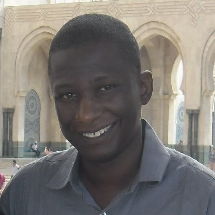

::: {.column-margin}

[{fig-align="center"}](../../team/aziz-goza.qmd)

:::

When we started nutriverse in 2018, we firmly believed that health and nutrition data can and should work better. Not through one-off, limited, and fragmented data and analysis tools but through transparent, coordinated data systems, robust and performant data tools, and a community of practice that is empowered to participate, utilise, and govern the use of this data.

This is why we are incredibly proud to share that **Abdoul-Aziz Goza**, one of the three stalwarts of nutriverse when we started in 2018, is **taking on the role of Executive Director**.

With over 15 years of experience in large-scale child nutrition data systems, Aziz is an expert in survey design, health and nutrition data quality assurance, and advanced statistical analysis. He has supported large-scale child nutrition systems across Africa and Asia, strengthening national platforms, and designing complex surveys.

As a former UNICEF Emergency Health and Nutrition Specialist in Niger, he brings experience and expertise in health and nutrition assessments such as KAP, [SMART](https://smartmethodology.org/), and [SQUEAC/SLEAC](https://www.fantaproject.org/sites/default/files/resources/SQUEAC-SLEAC-Technical-Reference-Oct2012_0.pdf) surveys in humanitarian contexts.

Aziz’s field experience stretches across the Sahel and beyond in countries such as Senegal, Mauritania, Mali, Burkina Faso, Cameroon, Kenya, Ethiopia, and Niger where he’s led surveys, training, and data system strengthening efforts. It’s this blend of technical expertise and on-the-ground experience that makes his insights so valuable.

Aziz's strategic leadership marks an important step forward for nutriverse as we continue building not just the tools and systems around health and nutrition data but most importantly an empowered community of practice that actively participates in, leverages, and stewards the use of this data.

Join us in celebrating this important milestone for nutriverse and in supporting Aziz's tenure as Executive Director!

## Related content for Abdoul-Aziz Goza

* [Case study on feedback mechanism that truly works even in the complex context of migration](https://www.linkedin.com/posts/abdoul-aziz-goza-86402090_listening-and-adapting-how-the-red-cross-activity-7343239312164986882-AocB?utm_source=share&utm_medium=member_desktop&rcm=ACoAAAGDNx8B1IQdnO3BfizE0c8LTL6j33B9x-o)

* ["I don't believe in 'training people'. I believe in co-growing." - on training and capacity-building](https://www.linkedin.com/posts/abdoul-aziz-goza-86402090_colearning-cogrowing-pmeal-activity-7330140291716247553-NwvS?utm_source=share&utm_medium=member_desktop&rcm=ACoAAAGDNx8B1IQdnO3BfizE0c8LTL6j33B9x-o)
