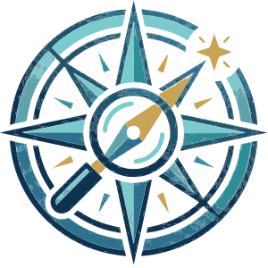

::: {.community-banner}

::: {.info-block}

<!-- > I hear and I forget;     
> I see and I remember;     
> I do and I understand. -->

> Go to the people. Live with them. Learn from them. Love them. Start with what they know. Build with what they have. But with the best leaders, when the work is done, the task accomplished, the people will say **‘We have done it ourselves’**.     
> - Lao Tzu

:::

:::

 
 

The [nutriverse](https://nutriverse.io) community of practice brings together nutrition data analysts, researchers, and practitioners who are committed to learning from one another and improving how nutrition data is analysed and applied. It provides a shared space to exchange methods, tools, and real-world experiences across research, policy, and practice.
  
Through peer learning, collaborative problem-solving, and open discussion, the community supports rigorous, reproducible analytics while staying grounded in practical impact. The goal is to strengthen individual practice, build collective capacity, and advance better nutrition decisions through better use of data.

We are committed to cultivating a welcoming, globally diverse community of software users and developers, data analysts, researchers, and practitioners. Whether you’re a long-time contributor or just getting started, we are dedicated to ensuring this is a safe and supportive space for you. We are committed to fostering a safe, inclusive, welcoming, and harassment-free experience for all.

We strive to foster a community grounded in shared values, a community where people feel comfortable exploring ideas and asking questions. We encourage everyone to assume good intent and recognise the competence of those they engage with.

To this end, we have a [Code of Conduct](https://nutriverse.io/code-of-conduct/) by which we expect members of the community to abide by.

## Ready to contribute?

There are many ways that you can contribute to the nutriverse community. We can summarise these into five types.

::: {.grid}

::: {.g-col-1}
:::

::: {.g-col-2}
{fig-align="center" height="100px"}
:::

::: {.g-col-2}
{fig-align="center" height="100px"}
:::

::: {.g-col-2}
{fig-align="center" height="100px"}
:::

::: {.g-col-2}
{fig-align="center" height="100px"}
:::

::: {.g-col-2}
{fig-align="center" height="100px"}
:::

::: {.g-col-1}
:::

:::

Read more about how to contribute to nutriverse from our [contributing guide](https://nutriverse.io/contributing/).

